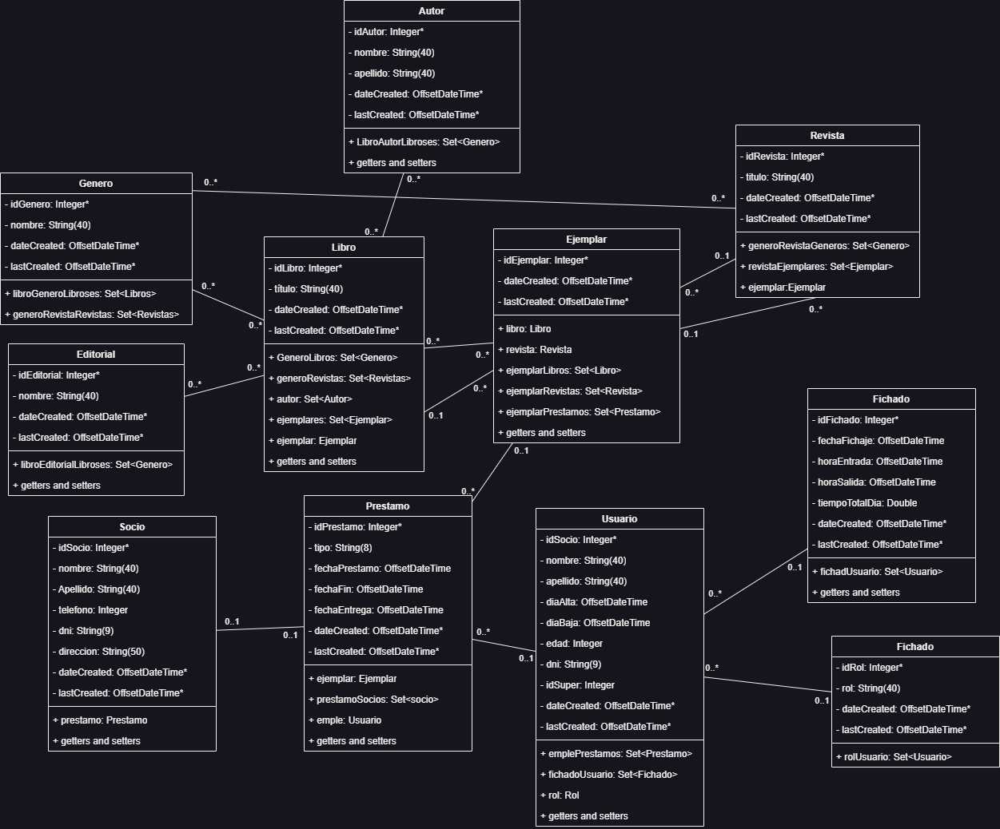
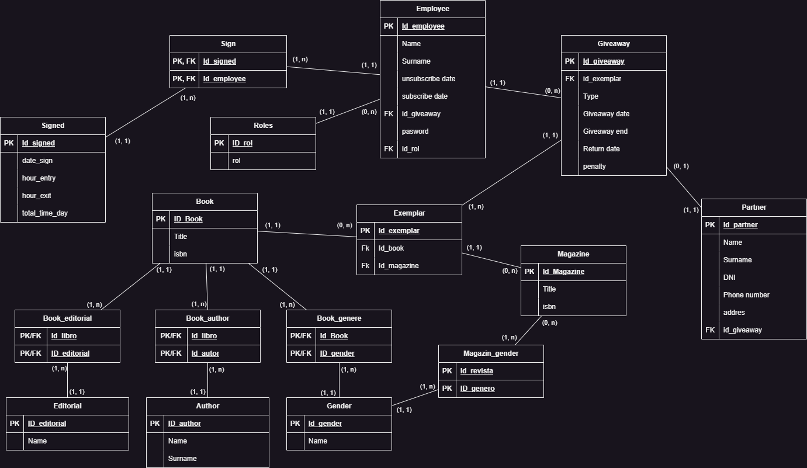

# System Library

The public version of a project to create a library system.

## Design

You can look at the project design:


## Development

Update your local database connection in `application.properties` or create your own `application-local.properties` file to override settings for development.

During development, it is recommended to use the `local` profile. In IntelliJ, `-Dspring.profiles.active=local` can be added in the VM options of the Run Configuration after enabling this property in "Modify options".

In addition to the Spring Boot application, the DevServer must also be started. [Node.js](https://nodejs.org/) must be installed on the system - the latest LTS version is recommended. On the first usage and after updates, the dependencies need to be installed:

```
npm install
```

Then, the DevServer can be started as follows:

```
npm run devserver
```

Using a proxy, the entire application is now accessible under `localhost:8081`. All changes to the templates and JS/CSS files are immediately visible in the browser.

## Build

The application can be built using the following command:

```
mvnw clean package
```

Node.js is automatically downloaded using the `frontend-maven-plugin`, and the final JS/CSS files are integrated into the JAR.

Start your application with the following command - here with the `production` profile:

```
java -Dspring.profiles.active=production -jar ./target/libreri-0.0.1-SNAPSHOT.jar
```

If required, a Docker image can be created with the Spring Boot plugin. Add `SPRING_PROFILES_ACTIVE=production` as an environment variable when running the container.

```
mvnw spring-boot:build-image -Dspring-boot.build-image.imageName=io.bootify/libreri
```

## Testing

Tests are automatically executed when the Spring Boot service starts. However, if you want to run tests separately, use:

```bash
mvn test
```

If you do not have Maven installed, you can use Gradle:

```bash
gradle test
```

## Architecture

The project follows the MVC (Model-View-Controller) architecture. However, there are versions of this project using different architectures if you want to compare and experiment with different structures.



And entity relationship model schema:



## Deployment System

You can see the deployed project at the following link:

[System Library Deployment](https://endless-datum-450720-e3.ew.r.appspot.com/)

Since this system is designed for supervisors, only they can add users. A class is implemented to generate three users with different roles:

1. **Admin Role:**
   - Username: Joaquin
   - Password: pepe1
2. **Supervisor Role:**
   - Username: Juan
   - Password: pepe2
3. **Employee Role:**
   - Username: Ruben
   - Password: pepe3

If you want to deploy the project for personal use, there are two options:

### **Local Deployment**

Check the `properties.example` file, save your credentials, and then run the application.

### **Cloud Deployment**

The project already includes the Google Cloud dependency. You only need to add the necessary credentials to connect to Google Cloud SQL. If you want to use this method, refer to `properties-prod` and add the appropriate credentials.

First, download and set up the [Google Cloud SDK](https://cloud.google.com/sdk?hl=en), configure it with your credentials, and then deploy the project using:

```bash
gcloud app deploy
```

If you prefer to use a Docker image, it is recommended to modify the `properties` file to accept environment variables. When deploying, pass your database credentials. Example:

```bash
gcloud run deploy mi-app \  
  --image docker.io/joakingc/library-system:latest \  
  --region europe-west1 \  
  --platform managed \  
  --vpc-connector my-connector \  
  --add-cloudsql-instances your_sql_instance \  
  --set-env-vars SPRING_PROFILES_ACTIVE=prod \  
  --allow-unauthenticated
```

## Further Readings

- [Maven documentation](https://maven.apache.org/guides/index.html)
- [Spring Boot reference](https://docs.spring.io/spring-boot/docs/current/reference/htmlsingle/)
- [Spring Data JPA reference](https://docs.spring.io/spring-data/jpa/docs/current/reference/html/)
- [Thymeleaf documentation](https://www.thymeleaf.org/documentation.html)
- [Webpack concepts](https://webpack.js.org/concepts/)
- [npm documentation](https://docs.npmjs.com/)
- [Bootstrap documentation](https://getbootstrap.com/docs/5.3/getting-started/introduction/)
- [Htmx documentation](https://htmx.org/docs/)
- [Learn Spring Boot with Thymeleaf](https://www.wimdeblauwe.com/books/taming-thymeleaf/)

## Screenshots

[](https://postimg.cc/Wdb5zQWc)
[](https://postimg.cc/F7xP99xx)
[](https://postimg.cc/F7xP99xx)
[](https://postimg.cc/Thg74jLF)
[](https://postimg.cc/1fSChgDt)
[](https://postimg.cc/jwrgxCBZ)

